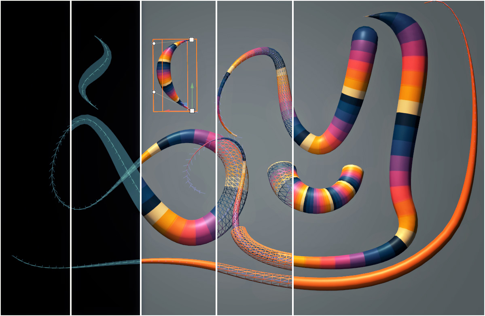

-informational) 

## godot-curvemesh
**Addon to generate customizable cylindrical meshes from 3D curves**

 

  
  
  

## Getting Started

1. Download the [repository](https://github.com/cloudofoz/godot-curvemesh/archive/refs/heads/main.zip) or download the (stable) addon from the AssetLib in Godot ([link](https://godotengine.org/asset-library/asset/1579)).
2. Import the **addons** folder into your project.
3. Activate `CurveMesh3D` under * *Project > Project Settings > Plugins.* *
4. Add a `CurveMesh3D` node to the scene.

## Changelog

v1.10
- adds customizable hemispherical caps to the generated mesh

[v1.00](https://github.com/cloudofoz/godot-curvemesh/releases/tag/v1.00)
- first release

## License

[MIT License](/LICENSE.md)
